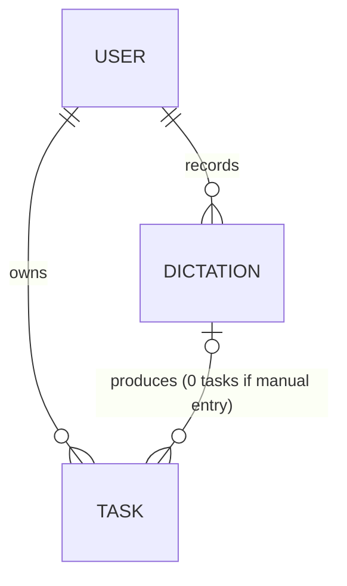
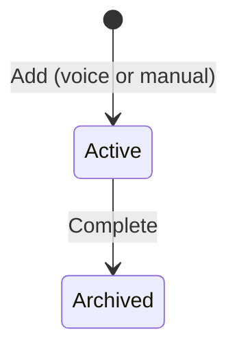
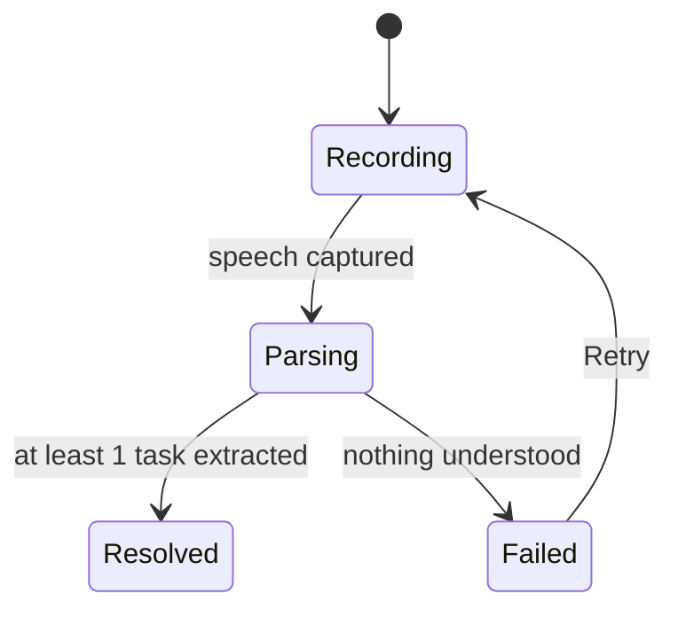

# Concept Model — To-do App

> Defines the objects the app recognises, their states, and the vocabulary
> used for them. Not a database schema, not a screen design — see
> [[Strategy]] for why, [[Project]] for the flows this model supports.
> Built from existing project docs (no new interview this session).

## Objects

### Task
The core thing — one concrete thing the user wants to do.
- **Attributes:** title, due date (optional), priority (optional), execution
  notes (optional), state (see below)
- **Relationships:** created via at most one Dictation (voice) — or none
  (manual entry); owned by one User
- **Actions:** Add (voice or manual, same verb either way), Edit, Complete

### Dictation
One continuous voice recording that gets turned into one or more Tasks.
Example: an evening planning session with 5 tasks in one breath = one
Dictation, five Tasks.
- **Attributes:** transcript, state (see below)
- **Relationships:** produces zero (if it fails), one, or many Tasks
- **Actions:** Start (record), Retry (if it failed)

### Set aside — not modelled as objects
- The "✓ Saved" toast and the "recently captured" review surface are UI,
  not objects — they're views over Task/Dictation state. Addressed at the
  interaction-flow layer, not here.
- **User** — exists (owns Tasks/Dictations) but not deeply modelled yet;
  single-user assumption, no accounts/sharing discussed. Device/account
  scope is open — see [[Project]] Platform note ("Desktop/native — open").

## Object map

## States

**Task** — decided 2026-07-19: completing a task archives it, removes it
from the active list.

**Dictation** — already implied by earlier decisions (never fail silently;
a wrong/missing field is not a failure, only total non-recognition is).

## Ubiquitous language

**Nouns**
| Term | Rejected alternatives | Why |
|---|---|---|
| Task | item, to-do, reminder | Already the term used across [[Project]]/[[Decisions]]/[[AI-Features]] |
| Dictation | recording, voice input, capture session | Already the term [[Project]] uses ("dictate") |

**Verbs**
| Term | Applies to | Rejected alternatives | Why |
|---|---|---|---|
| Add | Task | Create, Capture | One verb regardless of path (voice or manual) — fewer things to learn |
| Complete | Task | Finish, Check off | Names the real operation: moves Task to Archived |
| Edit | Task | Update | Correcting fields after save |
| Retry | Dictation | — | Only fires when nothing could be understood at all |

## Open questions
- Can an Archived Task be reopened, or is archiving final? Not decided.
- Is there a separate Delete (for a mistakenly-added task), distinct from
  Complete? Not decided.
- Priority scale — how many levels, what values? Not decided (AI prompt
  design question, see [[AI-Features]]).
- Keep the raw Dictation transcript after parsing? Not decided — flagging
  because "raw speech → parsed task" side-by-side has real value for the
  case-study narrative (see [[Strategy]] desired outcome).
- Multi-device/account scope for User/Task — out of scope for now, tied to
  the open platform question in [[Project]].

## Next
This defines what exists. Next: design how users interact with these
objects — places, screens, flow. Run `/layers-interaction-flow` when ready.
