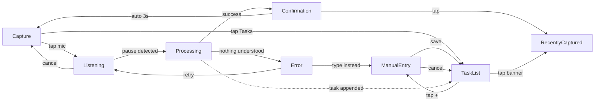

# Interaction Flow — Voice Capture (flagship flow)

> Breadboard for the flagship flow (Strategy [[Strategy]] Opportunity A —
> job stories 1, 3, 4: on the go / in the car / mid-conversation, "just
> remembered something"). Builds on [[Concept-Model]] (Task, Dictation).
> Interaction logic only — no visual design yet.

## Job story
"When I remember something while out and worry I'll forget it, I want to
dictate it in a second, so I can immediately stop thinking about it and
trust it's saved correctly." (See [[Project]] User needs #1.)

## Entry point — decided 2026-07-19
Open app → one tap on the mic button. Not auto-start-on-open (risk of
recording before the user's ready), not an OS-level shortcut (unproven for
a mobile web app — see [[Project]] Platform note). See [[Decisions]].

## Breadboard

```
Capture (landing — app opens here, not the Task List)
- tap mic → Listening
- tap "Tasks" → Task List
[content: mic button front and center, minimal chrome, small link to Task List]

Listening (sub-state of Capture)
- speaks, pause detected → (auto) Processing
- tap to cancel → Capture (nothing saved)
[content: recording indicator, cancel affordance]

Processing (transient — must be near-instant, or the "trust it saved" premise breaks)
- (auto, success) → Confirmation shown over Capture; Task added to Task List
- (auto, nothing understood at all) → Error/Retry shown over Capture
[content: subtle in-progress indicator]

Confirmation (transient overlay, ~3s auto-dismiss)
- (auto, 3s) → dismisses, back to Capture
- tap → Recently Captured (jumps to the task just created)
[content: "✓ Saved: <title>, <date>" — or "✓ Saved 3 tasks" for a batch dictation]

Error / Retry (overlay on Capture, does not auto-dismiss)
- tap "Retry" → Listening
- tap "Type it instead" → Manual Entry
[content: "Couldn't catch that — tap to retry or type it"]

Task List
- tap Complete on a Task → Task archived, removed from list (per [[Concept-Model]])
- tap "+" → Manual Entry
- tap "Recently Captured" banner (if unreviewed items exist) → Recently Captured
[content: Active tasks only — archived tasks are not shown here]

Recently Captured (optional review surface — never a gate, see [[Decisions]] 2026-07-19 reversal)
- edit a card inline → saves change, stays here
- dismiss a card → leaves this surface only (task itself stays in Task List)
[content: hybrid, inline-editable card list of recently added tasks]

Manual Entry (secondary/fallback path)
- fills fields, taps Save → Task List (Task added, Active)
- taps cancel → Task List (nothing added)
[content: typed form — title, date, priority, notes]
```

## Flow diagram



## Open decisions
- **Cancel/retry while eyes-free (driving).** Cancelling and retrying both
  currently require a tap. The "no dedicated eyes-free mode" decision
  ([[Decisions]] 2026-07-19) covers the happy-path Confirmation holding up
  without a glance — it doesn't yet cover Error/Retry. Is a screen glance
  acceptable for this rare edge case, or does it need a non-visual path too?
- **Raw transcript visibility.** Does Confirmation (or Recently Captured)
  ever show the raw Dictation transcript next to the parsed Task ("you
  said... → we created...")? Ties to the open question in
  [[Concept-Model]] about keeping transcripts — could be a strong,
  cheap case-study beat given the portfolio outcome in [[Strategy]].
- **Batch confirmation detail — resolved 2026-07-19, informed by Todoist's
  "Ramble" flow** (see [[References]]): a batch Dictation shows task cards
  progressively as each is recognised (Listening state), and ends with one
  explicit tap to finish/save the session — not per-task confirmation, not
  fully zero-touch either. See [[Decisions]]. Still open: does the finish
  tap route to Recently Captured pre-filtered to that session's tasks, or
  straight to Capture? Not detailed yet.

## Risks
- Depends on the mobile-web-app platform decision holding (still marked
  "open" for desktop/native in [[Project]]). If a native wrapper enters the
  picture later, the entry-point decision above should be revisited — native
  unlocks OS-level shortcuts that a pure web app can't reliably offer.
- Processing must be near-instant in practice — this is a hard non-functional
  requirement, not a nice-to-have; if parsing latency is noticeable, the
  "trust it saved" premise this whole flow is built on breaks.

## Next
This breadboard defines interaction logic without visual form. Whatever
comes next — code or detailed visual design — the conceptual model beneath
it ([[Concept-Model]]) should stay stable first.
