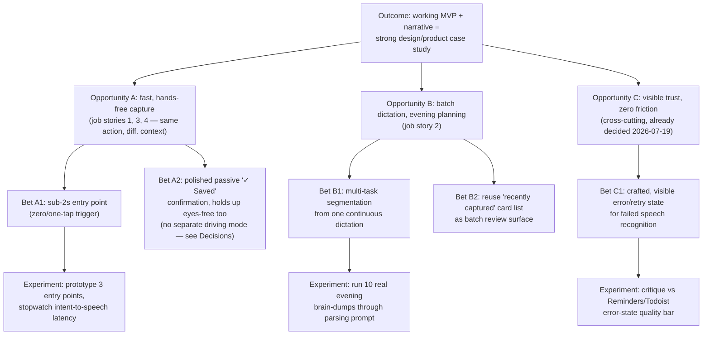

# Strategy — To-do App

## Session context
First product-strategy session for this project. The business outcome had not
been named anywhere before this session — see [[Decisions]] 2026-07-19.

## Desired outcome
**Ship a working MVP of the voice-first capture flow, polished enough to
stand as a design/product case study** — usable to show Goodface colleagues,
a personal-brand audience, and potential clients. Success = quality of the
working demo + the narrative around it (especially the job-story-driven
reversal of the confirm-gate decision) — not user count, retention, or
revenue.

**Consequence:** this reprioritizes the roadmap vs. a growth-outcome tree.
Onboarding, retention loops, notifications, cross-device sync — none of that
is needed for this outcome. Priority is getting one flow to a high level of
craft, not breadth.

Confidence: chosen 2026-07-19, first time discussed. Untested — treat as a
bet (does "working demo + narrative" actually land as a strong case study?),
not a fact.

## Opportunity tree

## Opportunities

### A — Fast, hands-free capture (job stories 1, 3, 4)
On-the-go, in the car, and mid-conversation are one opportunity, not three —
the same action under different physical constraints (per [[Project]] User
needs). This is the flagship flow; [[Project]] already names it "design and
polish this path first."

### B — Batch dictation for evening planning (job story 2)
Same core loop, different mode: multiple tasks in one continuous dictation,
lying down, deliberate rather than reflexive.

### C — Visible trust, zero friction (cross-cutting)
Not a new problem to solve — already decided 2026-07-19 (optimistic save,
never fail silently, see [[AI-Features]]). Included here because it's the
core proof point for the case-study narrative: the confirm-gate reversal and
the crafted failure path are strong "here's how we thought about this"
material.

## Solution bets, prioritized

1. **A1 + A2 — flagship flow: entry point + confirmation.** Lowest effort,
   highest narrative weight, already named first priority in [[Project]].
2. **C1 — crafted error/retry state.** Cheap, high case-study value — most
   generic AI to-do apps skip this state entirely; showing it is a
   differentiator.
3. **B1 + B2 — batch dictation for evening planning.** Proves range beyond
   single-task capture; can wait until the flagship flow is solid.

**Resolved fork — driving mode (see [[Decisions]] 2026-07-19):** no dedicated
eyes-free/audio-only mode for the in-car scenario. The general flow (A1/A2)
must simply hold up without requiring a screen glance — not a separate bet,
not a separate build.

## Deferred / not pursued
- Dedicated audio/haptic-only driving mode — considered, explicitly not
  pursued as a separate bet (see fork above).
- Anything serving a growth outcome (onboarding, retention, notifications,
  sync, monetization) — out of scope for a portfolio/case-study outcome.
  Revisit if/when the outcome changes.

## Open questions
- Is "working demo + narrative" actually sufficient for the case-study goal,
  or will it eventually need real (even small-scale) usage evidence? Not
  addressed this session.
- Job stories underlying this tree are self-reported (Ihor only), not
  validated with anyone else — see [[Project]] User needs confidence note.
- Timeframe/deadline for the case-study MVP not discussed this session.

## Next
These bets define what needs a conceptual model next — objects, states,
vocabulary for tasks/dictation/confirmation. Run `/layers-conceptual-model`
when ready.

## Related docs
- [[Project]] — vision, user needs, competitive set
- [[Decisions]] — decision log
- [[AI-Features]] — AI behaviour spec these bets build on
